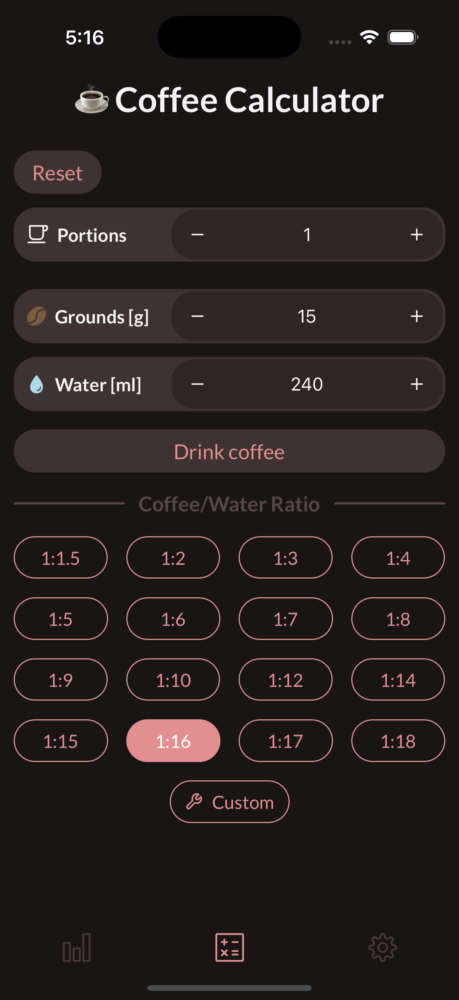
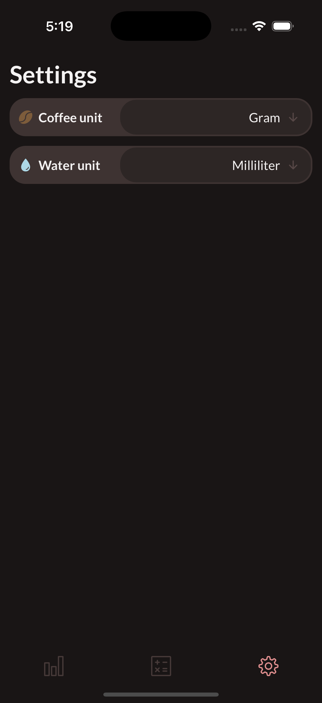

# Coffee calculator expo app
Simple react-native app for calculating the coffee-water ratio, as well as collecting stats on how much coffee you drink. Made with [Expo](https://expo.dev/) and a passion for caffeine.

TODO: actually publish the app

